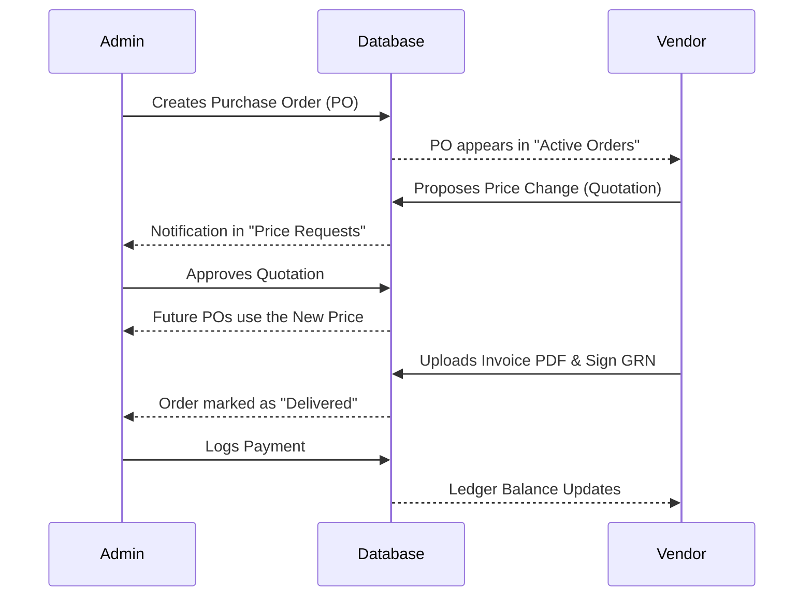

# Vendor Portal: Integration & Admin Guide

This document explains how the Vendor Portal connects to the Supermarket OS, how administrators manage it, and ideas for data visualization.

---

## 🔗 1. How the Portal Connects
The Vendor Portal is a **constrained view** of the master database. 

### Security & Isolation
- **Separate Auth**: Vendors use the `vendors` table and `Auth::vendorCheck()` logic. Their session is entirely separate from internal staff.
- **SQL Data Scoping**: Every query in the `VendorPortalController` is hard-coded with `WHERE vendor_id = ?`. 
  - *Example*: A vendor cannot see "All Products"; they only see products linked to `purchase_order_items` they have been assigned.
- **Retail Privacy**: The portal logic explicitly hides `sale_price` and `mrp`. It only displays `estimated_price` (the procurement cost).

---

## 🛠️ 2. Administrative Access
Administrators manage the portal through the **Supply Chain** section in the main dashboard sidebar.

### Key Admin Interfaces:
1. **Price Requests (`/admin/vendor/quotations`)**: 
   - Admins see a comparison of current vs. proposed prices.
   - Approval logic updates the procurement strategy for the next PO.
2. **Payments (`/admin/vendor/payments`)**: 
   - Admins manually log payments (Bank Transfer/UPI).
   - This creates a **Debit** entry in the `vendor_ledger`, balancing the **Credit** from delivered POs.
3. **Broadcasts (`/admin/vendor/broadcast`)**: 
   - A global notification system to send alerts to all supplier dashboards simultaneously.

---

## 📈 3. Data Visualization Ideas
To make the data more actionable for both vendors and admins, consider these display upgrades:

### For Vendors (Supplier Dashboard)
- **Delivery Heatmap**: A calendar view showing which days of the week have the most scheduled deliveries.
- **Stock Run-out Gauge**: A circular progress bar for each top product showing "Days of Stock Remaining."
- **Financial "Speedo"**: A gauge showing the percentage of their dues that have been paid vs. outstanding.

### For Admins (Central Oversight)
- **Supplier Reliability Index**: A chart showing "Ordered vs. Received" quantity trends for each vendor.
- **Procurement Cost Trend**: A line graph showing how the purchase price of key items has changed over the last 6 months based on approved quotations.
- **Regional Supply Map**: If you have many branches, a map showing which vendors are delivering to which regions most efficiently.

---

## 🏗️ 4. Integration Workflow (Technical)

